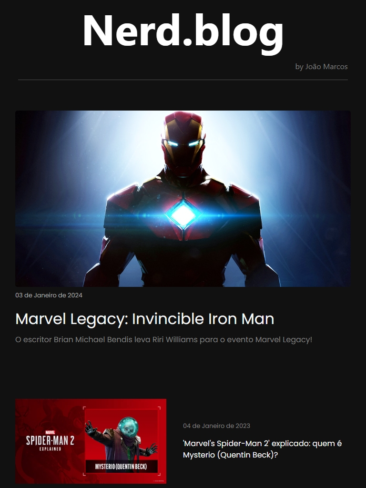

# AngularBlog

### Um pequeno Blog feito com Angular

Este projeto foi gerado com o Angular CLI na versão 14.1.2.

  
   
  
  

## Development server
Execute ng serve para iniciar um servidor de desenvolvimento. Navegue até http://localhost:4200/. A aplicação será recarregada automaticamente se você modificar qualquer um dos arquivos de origem.

## Further help
Para obter mais ajuda sobre o Angular CLI, use ng help ou consulte a página Visão Geral e Referência de Comandos do Angular CLI.

## Responsive Design
Sempre busco desenvolver projetos responsivos , mesmo em projetos pequenos

## Mobile

